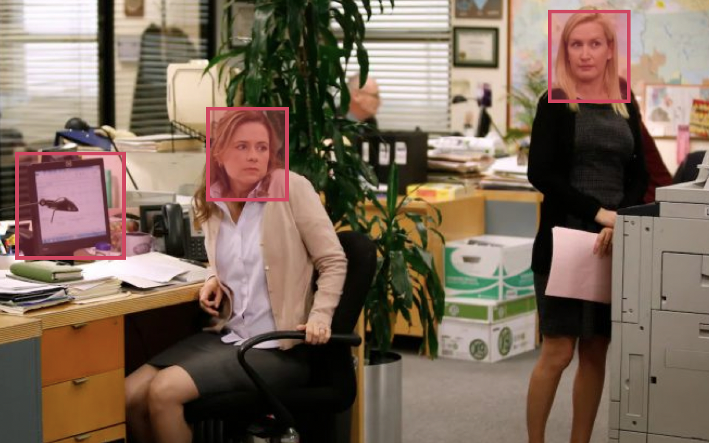

# MBA FIAP Inteligência Artificial & Machine Learning
Obtenha mais informações sobre a formação em inteligência artificial e a ementa completa no [portal](https://www.fiap.com.br/mba/mba-em-artificial-intelligence-e-machine-learning/) da FIAP.

## Visão Computacional Capstone

### Processamento de imagens aplicada a auditoria automática de vídeo baseada em modelos de deep-learning


Este projeto final tem como objetivo explorar os conhecimentos adquiridos nas aulas práticas. Por meio uma trilha guiada para construir uma aplicação que tem por objetivo analisar imagens e extrair uma série de informações que serão utilizadas para compor uma análise de imagens e vídeos afim de construir uma forma de auditoria automatizada baseado em modelos de inteligência artificial.

<p align="center">

</p>


### 1. Instruções

Nas aulas utilizaremos a distribuição Ananconda, com uso intensivo do Jupyter Notebook, que há vem instalado nesta distribuição.

Para instalar, acesse a sessão de [Downloads](https://www.anaconda.com/download) do Anaconda.

### 2. Repositório

Recomendamos clonar este repositório.

>**Importante**: como serão desenvolvidos modelos com arquivos grandes, é necessário ter um arquivo ```.gitignore``` com o seguinte conteúdo:

```
projeto/pesos/*
!projeto/pesos/.gitkeep 

projeto/modelos/*
!projeto/modelos/.gitkeep 

projeto/classificadores/*
!projeto/classificadores/.gitkeep 

projeto/.ipynb_checkpoints

.DS_Store
````

### 3. Template guiado

📙 Utilize o arquivo Jupyter [```projeto/object-people-audit.ipynb```](https://github.com/michelpf/fiap-ml-visao-computacional-capstone/blob/master/projeto/object-people-audit.ipynb), siga todas as instruções, completando e construindo os algoritmos necessários.

📕 Versão Google Colab [](https://colab.research.google.com/github/michelpf/fiap-ml-visao-computacional-capstone/blob/master/projeto/object-people-audit-colab.ipynb)

> **Atenção: o grupo/aluno que não utilizar este template (ou alterar partes indevidas) será automaticamente reprovado.**

### 4. Bibliotecas utilizadas

Este projeto requer **Python 3.5 ou superior** e as seguintes bibliotecas:

- [NumPy](http://www.numpy.org/)
- [Pandas](http://pandas.pydata.org/)
- [Matplotlib](http://matplotlib.org/)
- [Seaborn](http://seaborn.pydata.org/)
- [Scikit-learn](http://scikit-learn.org/stable/)
- [Keras](https://keras.io/)
- [Dlib](http://dlib.net/)
- [OpenCV](https://opencv.org/)

Também será utilizado o modelo de classificação de objetos [YOLOv3](https://pjreddie.com/darknet/yolo/). 

### 5. Critérios de avaliação

O projeto será avaliado pelos seguintes itens abaixo. A nota final será uma composição levando em consideração o peso de cada tema.

- Desenvolvimento do modelo de predição de idade (n1 _peso 2_)
- Desenvolvimento do modelo de predição de gênero  (n2 _peso 2)
- Detecção de faces e extração de região de interesse (n3 _peso 1_)
- Algoritmo de detecção de objetos (n4 _peso 1_)
- Processamento de vídeo (n5 _peso 2_)
- Conclusões finais (n6 _peso 2_)

Nota Final = 2 * n1 + 2 * n2 + n3 + n4 + 2 * n5 + 2 * n6

### 6. Dúvidas

Crie uma [Issue](https://github.com/michelpf/fiap-ml-visao-computacional-capstone/issues/new) com as perguntas para que as dúvidas sejam compartilhados com todos os alunos. Questionamentos particulares devem ser encaminhados pelo e-mail do professor.
